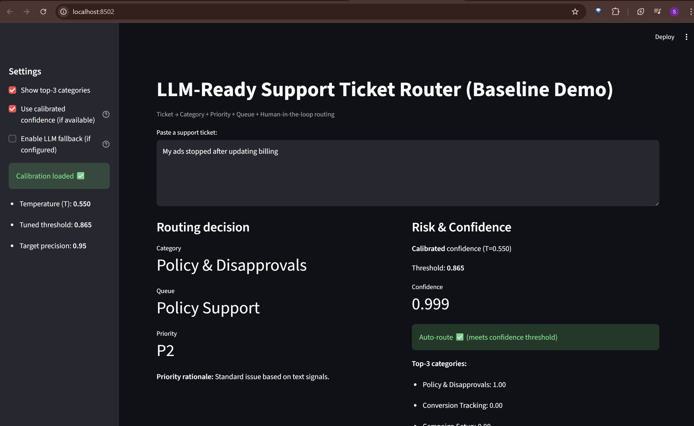

# Support Ticket Router (LLM-Ready) — Streamlit Demo

## Problem
Support teams receive high-volume of unstructured customer tickets that must be quickly routed to the correct queue quickly and prioritized appropriately.
Manual routing introduces several issues:
- Increased time-to-resolution (TTR)
- Inconsistent prioritization across agents
- Misrouted tickets causing rework and escalations
- Limited scalability during traffic spikes
In ads support environments (e.g., campaign setup, billing, technical issues), automation must be high-precision: misrouting billing or access issues can have immediate business impact.

## Objective
Design a risk-aware, data-driven ticket routing system that:
- Automatically classifies and prioritizes support tickets
- Auto-routes only when confidence is high
- Escalates ambiguous or high-risk cases to humans
- Uses LLms selectively to handle long-tail ambiguity
- Provides calibrated confidence estimates suitable for operational decision-making

## Solution (Baseline → LLM-Ready)
This repo implements a production-style routing pipeline:
- Probability calibration (temperature scaling) to make confidence estimates reliable
- Baseline ML classifier (TF-IDF + Logistic Regression) for scalable routing
- Threshold tuning to guarantee high precision for auto-routing
- Human-in-the-loop design for low-confidence and high-risk tickets
- LLM adjudicator fallback used only when ML is uncertain
A Streamlit app demonstrates the full decision pipeline end-to-end

## Taxonomy Design & Label Noise
Initial experiments using fine-grained categories resulted in poor performance due to semantic overlap and noisy label mappings. We redesigned the taxonomy to align with the information density of ticket text, improving macro F1 by X% and enabling reliable auto-routing
- Dataset: Public customer-support ticket dataset (~28k tickets)
- Text fields: Subject + body (normalized, PII-scrubbed)
- Final taxonomy (data-driven):
Technical Issue
Account & Billing
Campaign Setup
General Inquiry
Other

### Important:
Initial experiments with finer-grained categories performed poorly due to label noise and semantic overlap.
The taxonomy was redesigned to align with the information density of ticket text — a critical step that significantly improved model reliability.

## Streamlit Demo


## How to run
```bash
python -m venv .venv && source .venv/bin/activate
pip install -r requirements.txt

python scripts/train_baseline.py
streamlit run app/streamlit_app.py
